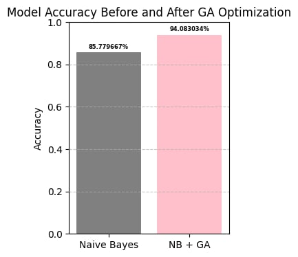
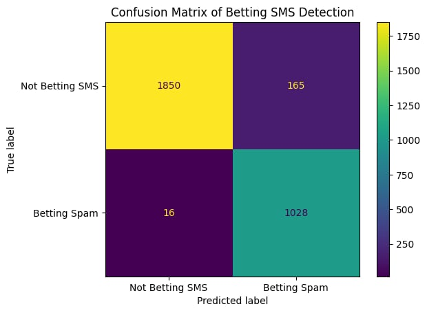
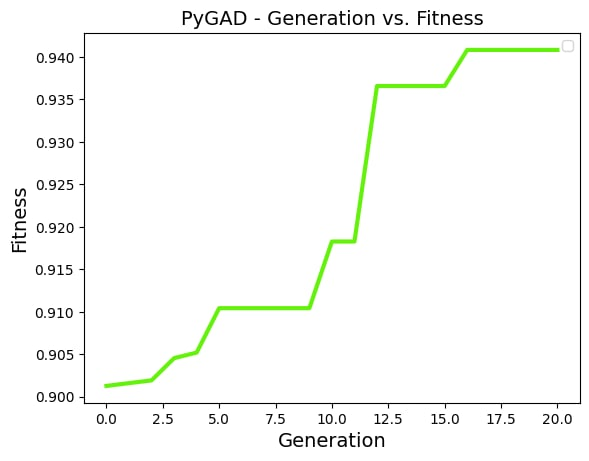

# Betting-Related SMS Spam Detection Using Naive Bayes Optimized with Genetic Algorithm

This project develops a **Betting SMS Spam Filter** using a **Multinomial Naive Bayes (MNB)** classifier. The core goal is to maximize the filter's performance—specifically its accuracy and ability to catch spam—by employing a **Genetic Algorithm (GA)** for hyperparameter optimization.

The final model achieves an accuracy of **94.08%**, a significant improvement over the baseline model's 85.78%.

### Performance Comparison (Baseline vs. Optimized)

| Model                   | Accuracy   | Improvement |
| :---------------------- | :--------- | :---------- |
| **Baseline (NB)**       | **85.78%** | ---         |
| **Optimized (NB + GA)** | **94.08%** | **+8.30%**  |

---

## Computational Modeling Component: **Multinomial Naive Bayes**

### Simulation Workflow

#### Experimental Design

1.  **Data Preparation:** The SMS data is loaded and categorized into `bspam` and `not_bspam`.
2.  **Text Vectorization:** Messages are transformed into numerical feature vectors using a **CountVectorizer**.
3.  **Model Training (Baseline):** The MNB model is trained using default parameters .
4.  **Optimization:** A **Genetic Algorithm (GA)** is implemented to find the optimal hyperparameters for the MNB model (e.g., smoothing parameter and n-gram range).
5.  **Model Training (Optimized):** The MNB model is retrained using the best parameters found by the GA.
6.  **Evaluation:** Both baseline and optimized models are evaluated using accuracy, classification reports, and confusion matrices.

#### Model Initialization

- **Baseline NB:** Initialized with default parameters: `alpha=1.0`.
  - Parameters: `alpha=1.0`, `force_alpha=True`, `fit_prior=True`, `class_prior=None`.
- **Reproducibility:** The `random` and `numpy` seeds were set to **42** to ensure that data splits and other random processes are consistent across runs.

#### Data Collection and Storage

| Category | Count | Unique Messages | Top Message Example |
| :-- | :-- | :-- | :-- |
| **bspam** | 4176 | 1392 | `claim b0nus up to 2,000! win jili jackpot...` |
| **not_bspam** | 8060 | 3993 | `ex. "Uy alam mo ba, buntis si Aling Marites?...` |

The dataset is highly imbalanced, with more than double the amount of non-betting spam messages than betting spam messages.

#### Workflow Automation and Reproducibility

The entire process, from data loading to optimization, is contained within the Jupyter Notebook. The use of fixed seeds ensures that any user running the notebook will reproduce the exact same training and optimization results.

---

## Computational Intelligence Component: **Genetic Algorithm (GA)**

### Integration of Computational Technique to Model

The GA was integrated by defining a **fitness function** that runs the following steps:

1.  Initialize a **CountVectorizer** using the GA-proposed `ngram_range` and stop words setting.
2.  Initialize a **MultinomialNB** model using the GA-proposed `alpha` smoothing parameter.
3.  Train and test the model.
4.  Return the model's **accuracy** as the **fitness score**.

The GA iteratively searched for the set of hyperparameters that maximized this fitness score.

- **Best GA Solution Parameters Found:** `(alpha=0.032546..., ngram_range=(1, 2), stop_words='english')`

---

### Confusion Matrix: Baseline vs. Optimized Model

  

    <h4 style="margin-bottom: 5px;">Baseline NB (Accuracy: 85.78%)</h4>
    
  

  

    <h4 style="margin-bottom: 5px;">Optimized NB + GA (Accuracy: 94.08%)</h4>
    
  

### GA Convergence and Runtime

The GA successfully converged to the maximum fitness within **16 generations**.

- **Interpretation:** The plot shows a **rapid jump in fitness** around **Generation 11**, indicating that the genetic operations (crossover/mutation) successfully discovered a near-optimal set of hyperparameters, moving the model out of a local optimum.
